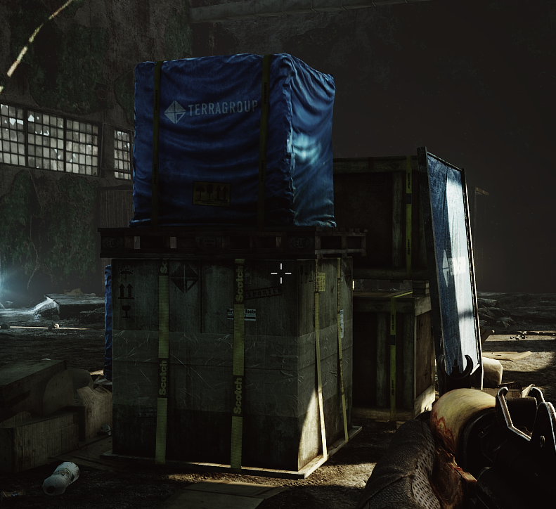
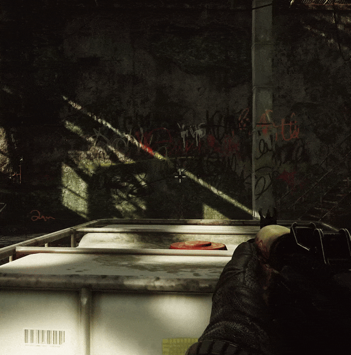

## About Mod

A mostly-static image-based crosshair with such features as: somewhat-intelligent hiding and... that's about it! For all the non-purists among us.

Hey, it's better than a monitor crosshair or an overlay one!

*With optional (turned off by default) dynamic positioning!*

## Configuration

You can adjust the crosshair image by dropping a PNG image named `custom_crosshair.png` inside of the `<spt-folder>\BepInEx\SimpleCrosshair\` folder. It will load that image instead of the default one.

### General

- **Crosshair Image**: The image to load out of the plugin directory, lists all found .png files on game launch
- **Show Crosshair**: If the crosshair should be shown, works as initial value if using keyboard shortcut with Press Toggles
- **Crosshair Color**: Adjust the color and opacity of the crosshair
- **Crosshair Size**: Adjust the size of the crosshair. Image will fit into the square bounds.
- **Crosshair Fade Time**: Adjust the fade in/out time on show/hide
- **Crosshair X/Y Offset**: Adjust the offset of the crosshair outside of the exact middle. Good for a custom crosshair where the middle of the image is not the aim point.

### Dynamic Positioning
- **Enable Dynamic Crosshair Position**: Instead of just being a static image in the direct middle, dynamically reposition with weapon facing
- **Center Radius Behavior**: What to do if the crosshair is/out of the center radius
    - **Hide Inside**: Hide crosshair when in the center circle, good for only showing when the weapon is obstructed
    - **Hide Outside**: Hide crosshair when outside the center circle, good for ignoring when weapon is way outside
- **Center Radius**: The radius of a centered circle to do the above behavior on
    - Try ~100 with Hide Inside, to act only as a warning
    - Try ~300 with Hide Outside, to ignore when the weapon isn't facing forward

### Keyboard Shortcuts
- **Keyboard Shortcut**: A keyboard shortcut to press
- **Shortcut Behavior**: What to do when the keyboard shortcut button is pressed
    - **Press Toggles**: Shows and hides the crosshair, taking the "Show Crosshair" option as an initial value
    - **Show While Holding**: Shows the crosshair while the shortcut button is held down.

## Installation

[Releases are here](https://github.com/mpstark/SPT-SimpleCrosshair/releases). Open zip file and drag `BepInEx` folder into root of your SPT-AKI install.

## License

Distributed under the MIT license. See [`LICENSE.txt`](LICENSE.txt) for more details.

## Acknowledgments

- [CJ](https://github.com/CJ-SPT) for letting me hack on [StashSearch](https://github.com/CJ-SPT/StashSearch) as my first SPT-AKI modding experience
- [DrakiaXYZ](https://github.com/DrakiaXYZ) for having multiple great mods to look at for examples
- [Arys](https://github.com/Nympfonic) for being awesome
